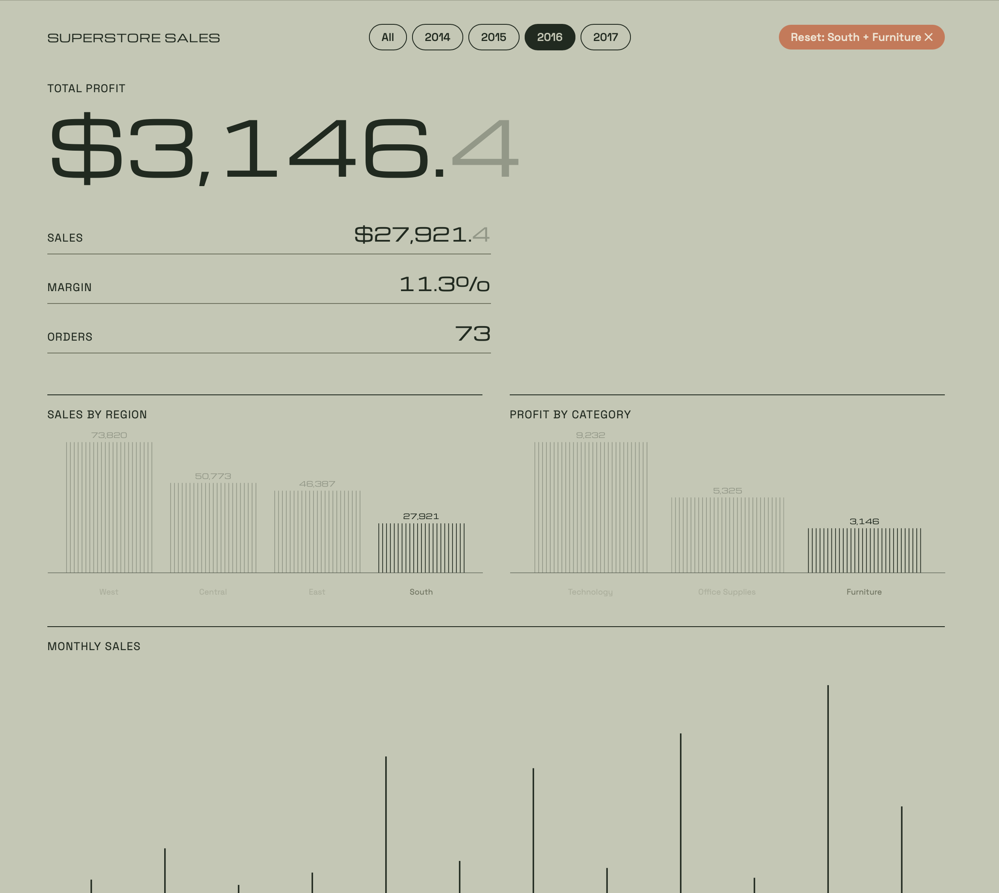

# Superstore Sales Dashboard

An interactive sales dashboard built on a MySQL database. A Node API runs `GROUP BY` queries on 9,994 retail orders, and a React app draws the results with D3. Click a region or category to filter every other chart.




## Key findings

- **Profit margin is 12.5%.** Total sales are about $2.30M and total profit about $286K.
- **West is the strongest region** with $725K in sales and $108K in profit. Central has the weakest margin: $501K in sales for only $40K in profit.
- **Furniture barely makes money.** It sells $742K but earns only $18K in profit, while Technology earns $145K on $836K.
- **Discounts of 30% or more lose money.** Average profit per order is $67 at no discount, then -$46 at 30% and -$311 at 50%.
- **Sales peak in November and December** every year, and each year is higher than the last.


## How it works

```
MySQL (superstore.orders)  ->  Node + Express API  ->  React + D3 dashboard
        GROUP BY queries         /api/* endpoints        charts, filters
```

| Endpoint | Returns |
|---|---|
| `/api/kpis` | total sales, profit, order count |
| `/api/region` | sales and profit by region |
| `/api/category` | sales and profit by category |
| `/api/monthly` | sales and profit by month |
| `/api/discount` | average profit by discount level |
| `/api/years` | years available for the filter |

Every endpoint accepts `?year=`, `?region=` and `?category=`, so MySQL does the filtering and grouping, not the browser.

## Tech stack

MySQL 8.4, Node.js, Express, mysql2, React, Vite, D3.js

## Run it locally

**1. Database.** Create the table with `schema.sql` from the companion repo, then load the Superstore CSV (Kaggle: "Superstore dataset"):

```sql
CREATE DATABASE superstore;
-- then create the orders table and load the CSV
```

**2. Install.**

```
git clone https://github.com/Yash-buddy/superstore-dashboard.git
cd superstore-dashboard
npm install
```

**3. Add your MySQL password.** Create a `.env` file in the project root (it is git-ignored):

```
DB_PASSWORD=your_mysql_password
```

**4. Start the API** in one terminal:

```
node --env-file=.env server/index.js
```

**5. Start the dashboard** in a second terminal:

```
npm run dev
```

Open http://localhost:5173.

## Project structure

```
server/index.js            API and SQL queries
src/App.jsx                layout, filters, state
src/hooks/useApi.js        fetches data from the API
src/components/
  HairlineBars.jsx         bar chart drawn with thin lines (D3 scales)
  Money.jsx                large number with a faded last digit
```

## What I learned

- Designing a table with data types and a primary key, and loading a CSV into MySQL.
- Writing `GROUP BY` queries and moving filtering into SQL.
- Building a small REST API, and why a browser cannot talk to MySQL directly.
- Keeping secrets in `.env` and out of Git.

## Related

SQL analysis and queries: [superstore-sql](https://github.com/Yash-buddy/superstore-sql)

